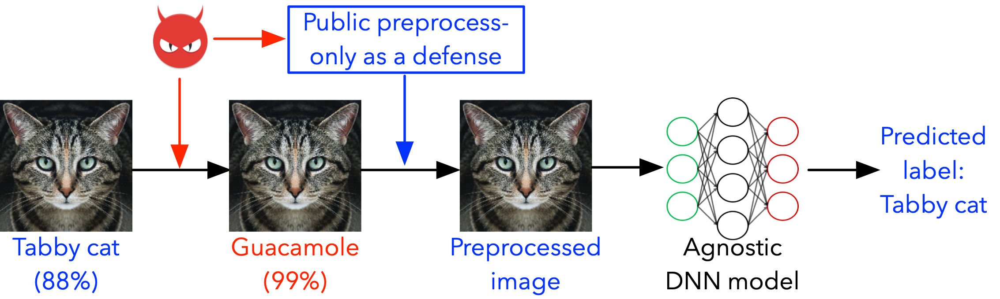
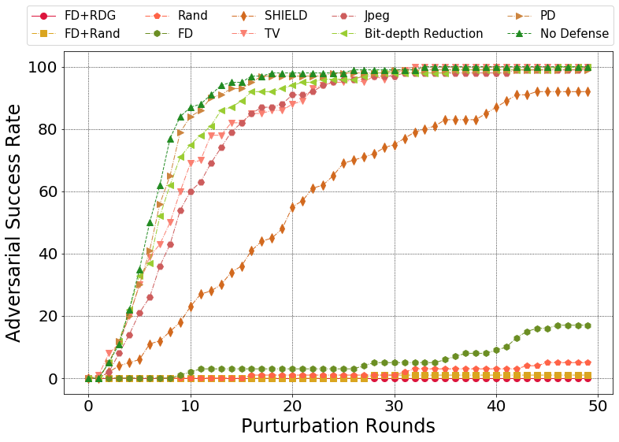
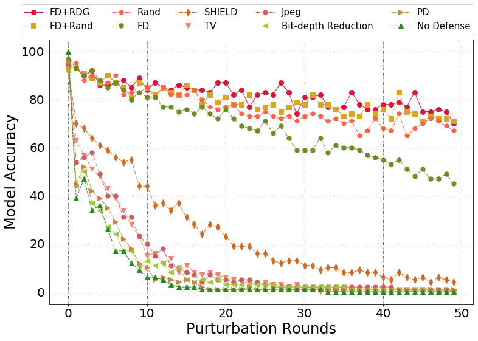
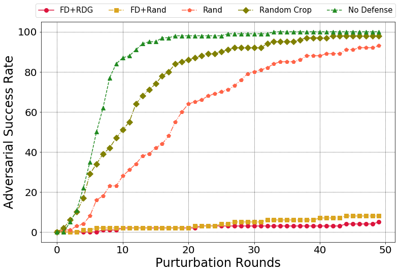
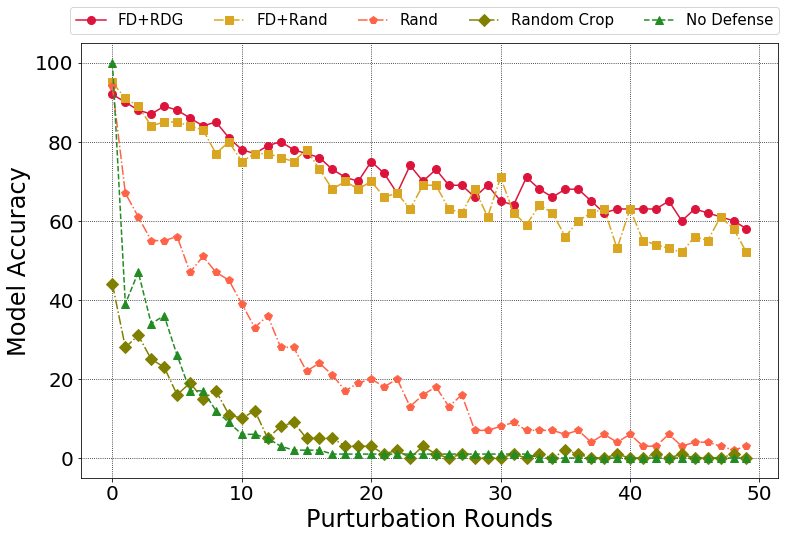
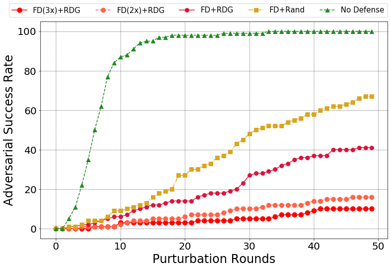
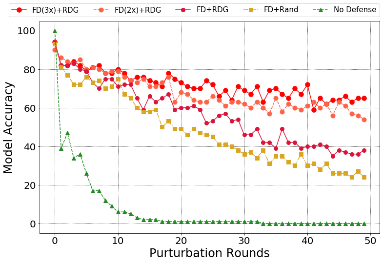

# Mitigating Advanced Adversarial Attacks with More Advanced Gradient Obfuscation Techniques

This repository is the official implementation of [Mitigating Advanced Adversarial Attacks with More Advanced Gradient Obfuscation Techniques](https://arxiv.org/abs/2005.13712).

## Introduction

***Deep Neural Networks*** (DNNs) are well-known to be vulnerable to ***Adversarial Examples*** (AEs). Recently, advanced gradient-based attacks were proposed (e.g., BPDA and EOT) and defeated a considerable number of existing defense methods. Up to today, there are still no satisfactory solutions that can effectively and efficiently defend these attacks.

In this work, we make a steady step towards mitigating those advanced gradient-based attacks with two major contributions. 

First, we perform an in-depth analysis of the root causes of those attacks and propose four properties that can break the fundamental assumptions of those attacks.

Second, we identify a set of operations that can meet those properties. 
By integrating these operations, we design a preprocessing method (FD+RDG) that can invalidate these powerful attacks. 
Extensive evaluations indicate that our solutions can effectively mitigate all existing standard and advanced attack techniques, 
and beat state-of-the-art defense solutions published in top-tier conferences over the past 2 years. 

To be noticed, our work does not require retraining of the model or any modification of the target model. 
Thus even for large models like inception families, our work can protect them on the fly.
An illustration of the working manner of pre-processing based defense techniques is summarized as follows:



For attacks used to demonstrate our proposed theory's efficiency:
1. This repository includes detailed implementation of interactive attacks includes BPDA, BPDA+EOT, and Semi-Brute-Force attack based on the EOT. Some of the code here is referring to Anish & Carlini's Github: [obfuscated-gradients](https://github.com/anishathalye/obfuscated-gradients). 
2. This repository includes the implementation of standard attacks includes FGSM, BIM, LBFGS, C&W, and DeepFool. 
All the attacks here listed are based on [cleverhans](https://github.com/carlini/cleverhans).


For defenses compared with our proposed techniques against the aforementioned attacks:
1. We compared our methods with [Randomization Layer](https://openreview.net/forum?id=Sk9yuql0Z), [Feature Distillation](https://ieeexplore.ieee.org/stamp/stamp.jsp?tp=&arnumber=8953640), [SHIELD](https://dl.acm.org/doi/pdf/10.1145/3219819.3219910), [Total Variance, Jepg compression, Bit-depth Reduction, Pixel Deflection](https://openreview.net/forum?id=SyJ7ClWCb), and the original [Inception V3](https://www.cv-foundation.org/openaccess/content_cvpr_2016/papers/Szegedy_Rethinking_the_Inception_CVPR_2016_paper.pdf) with no defense as the baseline under the BPDA attack.
2. We compared our methods with [Randomization Layer](https://openreview.net/forum?id=Sk9yuql0Z), [Random Crop](https://openreview.net/forum?id=SyJ7ClWCb) under the BPDA+EOT attack.

## Demonstration

For a single image as the input, defense effects (Random Distortion over Grids, RDG) are demonstrated.

1. 'BPDA_demo.ipynb' shows the effects of our method protecting an input against the BPDA attack.
2. 'EOT_demo.ipynb' shows the effects of our method protecting an input against the BPDA+EOT attack.
3. A visual demo of the random distortion over grids, which is as well proposed in our paper, is presented in 'RDG_visual_demo.ipynb'.
   

## Requirements
To install requirements and pre-trained Inception V3 model:
```setup
sudo sh setup.sh
```
The environment is set up as follows: Python 3.7; cleverhans 2.1.0; Tensorflow 1.13.1; albumentations 0.4.3; scipy 1.3.1.
The 100 clean data selected from the ImageNet Validation set can be download following this link: [Google Drive Link](https://drive.google.com/open?id=1XiuKXBRW-uw4qoYCa30ymbpIM7wBfxmy).
Please carefully check before playing with this repository see if all the data related files are placed into the '/data/' folder.

## Evaluation
1. The evaluation comparing different defense methods against the BPDA attack is conducted in 'BPDA_compare.ipynb'.
2. The evaluation comparing different defense methods against the BPDA+EOT attack is conducted in 'EOT_compare.ipynb'.
3. The evaluation comparing our proposed methods against Semi-Brute-Force attack based on the EOT is conducted in 'adaptive_EOT_test.ipynb'.
4. We generated standard adversarial examples, namely based on FGSM, BIM, LBFGS, C&W, and DeepFool to test our proposed technique in 'AE_generation.ipynb'.

## Results

Comparision of different defense methods over BPDA:

Attack success rate:



Model accuracy:



Comparision of different defense methods over BPDA+EOT:

Attack success rate:



Model accuracy:



Comparision of different defense methods over Semi-Brute-Force Attack based on EOT:

Attack success rate:



Model accuracy:



## Contributing
If you'd like to contribute or have any suggestions for this repository, you can directly open an issue on this GitHub repository.
All contributions welcome! 

